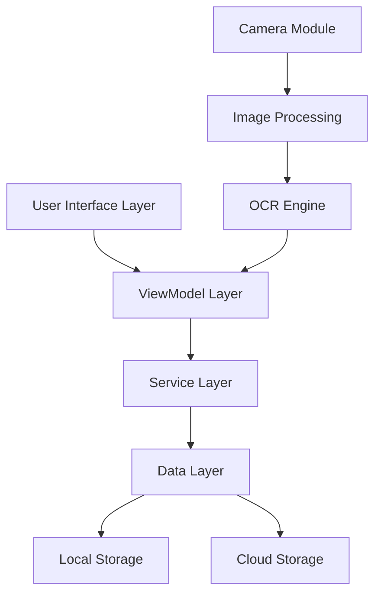
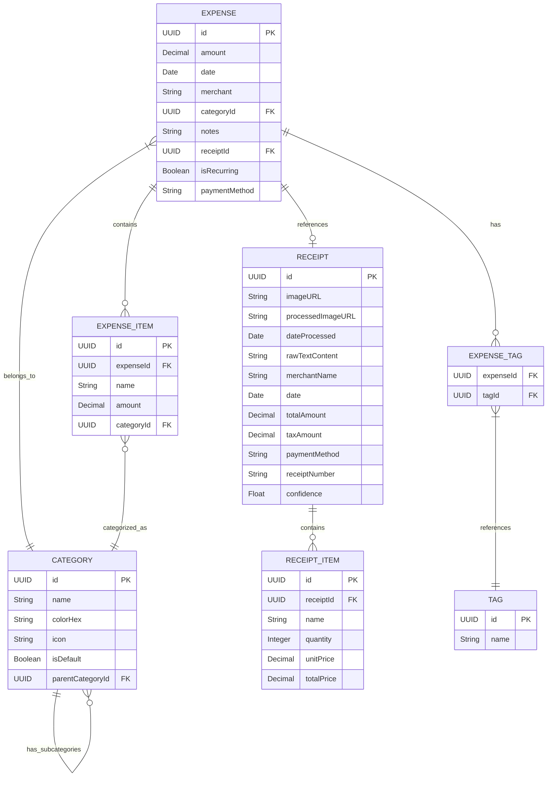

# Design Document: Receipt Scanner Expense Tracker

## Overview

The Receipt Scanner Expense Tracker is an iOS application built with Swift that allows users to scan receipts using their device's camera, extract relevant information, categorize expenses, and generate reports. The app aims to simplify expense tracking by minimizing manual data entry and providing insightful analytics on spending patterns.

## Architecture

The application will follow the MVVM (Model-View-ViewModel) architecture pattern to ensure separation of concerns, testability, and maintainability. Additionally, we'll incorporate the Coordinator pattern for navigation flow management.

### High-Level Architecture



### Key Components

1. **Presentation Layer**
   - SwiftUI Views
   - UIKit Components (where necessary)
   - View Models
   - Coordinators

2. **Business Logic Layer**
   - Receipt Processing Service
   - Expense Management Service
   - Analytics Service
   - Authentication Service

3. **Data Layer**
   - Repository Interfaces
   - Data Models
   - Local Storage (Core Data)
   - Cloud Sync (CloudKit)

4. **Core Services**
   - OCR Engine
   - Image Processing
   - Machine Learning Models

## Components and Interfaces

### UI Components

1. **Main Tab Structure**
   - Home/Dashboard
   - Scan Receipt
   - Expenses List
   - Reports
   - Settings

2. **Receipt Scanning Flow**
   - Camera View
   - Processing Overlay
   - Data Extraction Review
   - Category Selection
   - Confirmation

3. **Expense Management**
   - List View with Filtering
   - Detail View
   - Edit View
   - Category Management

4. **Reporting**
   - Summary Dashboard
   - Detailed Reports
   - Charts and Graphs
   - Export Options

### Core Services

#### Camera and Image Processing Service

```swift
protocol ImageCaptureServiceProtocol {
    func captureImage() async throws -> UIImage
    func processReceiptImage(_ image: UIImage) async throws -> UIImage
}

protocol OCRServiceProtocol {
    func extractTextFromImage(_ image: UIImage) async throws -> String
    func parseReceiptData(_ text: String) async throws -> ReceiptData
}
```

#### Expense Management Service

```swift
protocol ExpenseServiceProtocol {
    func saveExpense(_ expense: Expense) async throws
    func getExpenses(filter: ExpenseFilter?) async throws -> [Expense]
    func updateExpense(_ expense: Expense) async throws
    func deleteExpense(id: UUID) async throws
    func categorizeExpense(_ expense: Expense) async throws -> Category
}
```

#### Analytics Service

```swift
protocol AnalyticsServiceProtocol {
    func getSpendingSummary(period: TimePeriod) async throws -> SpendingSummary
    func getSpendingByCategory(period: TimePeriod) async throws -> [CategorySpending]
    func getSpendingTrends(periods: [TimePeriod]) async throws -> SpendingTrends
    func exportReport(format: ReportFormat, filter: ExpenseFilter) async throws -> URL
}
```

## Data Models

### Core Models

#### Receipt

```swift
struct Receipt {
    let id: UUID
    let imageURL: URL
    let processedImageURL: URL?
    let dateProcessed: Date
    let rawTextContent: String?
    let extractedData: ReceiptData
}

struct ReceiptData {
    let merchantName: String
    let date: Date
    let totalAmount: Decimal
    let taxAmount: Decimal?
    let items: [ReceiptItem]?
    let paymentMethod: String?
    let receiptNumber: String?
    let confidence: Float // OCR confidence score
}

struct ReceiptItem {
    let name: String
    let quantity: Int?
    let unitPrice: Decimal?
    let totalPrice: Decimal
}
```

#### Expense

```swift
struct Expense {
    let id: UUID
    let amount: Decimal
    let date: Date
    let merchant: String
    let category: Category
    let tags: [String]
    let notes: String?
    let receiptId: UUID?
    let isRecurring: Bool
    let paymentMethod: String?
    let items: [ExpenseItem]?
}

struct ExpenseItem {
    let id: UUID
    let name: String
    let amount: Decimal
    let category: Category?
}

struct Category {
    let id: UUID
    let name: String
    let color: UIColor
    let icon: String // SF Symbol name
    let isDefault: Bool
    let parentCategoryId: UUID?
}
```

### Database Schema

The app will use Core Data for local storage with the following entity relationships:



## Error Handling

The application will implement a comprehensive error handling strategy:

1. **User-Facing Errors**
   - Clear, actionable error messages
   - Contextual guidance for resolution
   - Non-technical language

2. **System Errors**
   - Logging framework for debugging
   - Crash reporting integration
   - Graceful degradation of features

3. **Error Types**
   - Camera/Permission Errors
   - OCR Processing Errors
   - Data Storage Errors
   - Network/Sync Errors

```swift
enum AppError: Error {
    case cameraUnavailable
    case permissionDenied(PermissionType)
    case imageProcessingFailed(String)
    case ocrFailed(String)
    case dataExtractionFailed(String)
    case storageError(String)
    case networkError(String)
    case authenticationError(String)
    
    var userFacingMessage: String {
        // User-friendly error messages
    }
    
    var recoverySuggestion: String {
        // Suggestions to resolve the error
    }
}
```

## Testing Strategy

### Unit Testing

- ViewModel logic testing
- Service layer testing
- Repository testing
- Data model validation

### Integration Testing

- OCR pipeline testing
- Data flow between layers
- Storage and retrieval operations

### UI Testing

- Critical user flows
- Accessibility testing
- Device compatibility

### Performance Testing

- Image processing speed
- Database query performance
- Memory usage during scanning

## Security Considerations

1. **Data Protection**
   - On-device encryption for receipt data
   - Secure storage of financial information
   - Privacy-first approach to data collection

2. **Authentication**
   - Biometric authentication option
   - Secure app lock
   - Session management

3. **Cloud Security**
   - Encrypted data transmission
   - Secure CloudKit implementation
   - User data isolation

## Implementation Approach

### Phase 1: Core Functionality

- Basic UI implementation
- Camera integration and image capture
- Simple OCR implementation
- Manual data entry fallback
- Local storage

### Phase 2: Enhanced Features

- Advanced OCR with machine learning
- Expense categorization
- Basic reporting
- Data export

### Phase 3: Advanced Features

- Cloud synchronization
- Advanced analytics
- Budget tracking
- Receipt item detection

## Technical Stack

- **UI Framework**: SwiftUI with UIKit integration where needed
- **Architecture**: MVVM + Coordinator
- **Local Storage**: Core Data
- **Cloud Storage**: CloudKit
- **Image Processing**: Vision framework
- **OCR**: Vision + CoreML
- **Authentication**: LocalAuthentication framework
- **Networking**: Combine + URLSession
- **Dependency Management**: Swift Package Manager
- **Testing**: XCTest

## Accessibility Considerations

- VoiceOver support for all screens
- Dynamic Type for text scaling
- Sufficient color contrast
- Haptic feedback
- Keyboard navigation support
- Reduced motion option