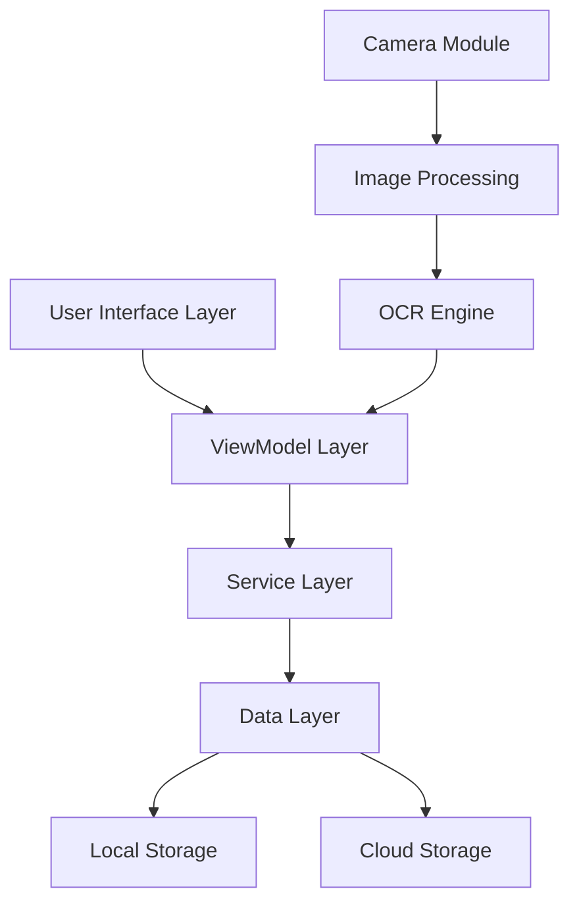
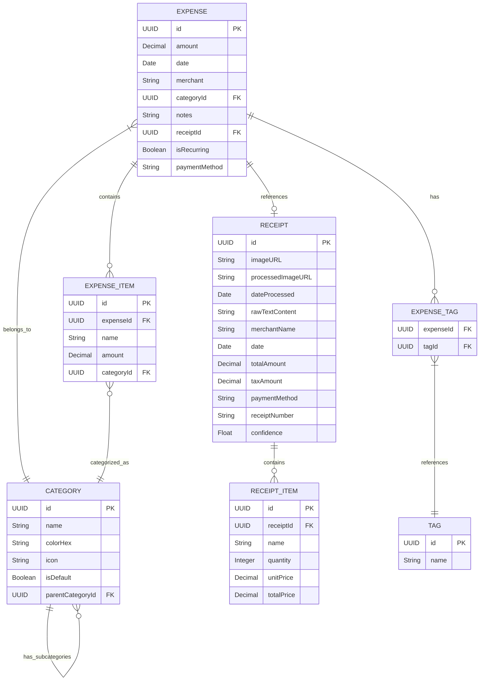

# Design Document: Receipt Scanner Expense Tracker

## Overview

The Receipt Scanner Expense Tracker is an iOS application built with Swift that allows users to scan receipts using their device's camera, extract relevant information, categorize expenses, and generate reports. The app aims to simplify expense tracking by minimizing manual data entry and providing insightful analytics on spending patterns.

**Key Design Principles:**
- **Accessibility First**: Full support for iOS accessibility features including VoiceOver, Dynamic Type, and reduced motion
- **Offline Capability**: Core functionality available without internet connection, with background sync when online
- **Security by Design**: End-to-end encryption for sensitive financial data with biometric authentication
- **Progressive Enhancement**: Graceful degradation when OCR confidence is low, with manual input fallbacks
- **Performance Optimized**: Efficient image processing and database operations to minimize battery usage

## Architecture

The application will follow the MVVM (Model-View-ViewModel) architecture pattern to ensure separation of concerns, testability, and maintainability. Additionally, we'll incorporate the Coordinator pattern for navigation flow management.

### High-Level Architecture



### Key Components

1. **Presentation Layer**
   - SwiftUI Views
   - UIKit Components (where necessary)
   - View Models
   - Coordinators

2. **Business Logic Layer**
   - Receipt Processing Service
   - Expense Management Service
   - Analytics Service
   - Authentication Service

3. **Data Layer**
   - Repository Interfaces
   - Data Models
   - Local Storage (Core Data)
   - Cloud Sync (CloudKit)

4. **Core Services**
   - OCR Engine
   - Image Processing
   - Machine Learning Models

## Components and Interfaces

### UI Components

1. **Main Tab Structure**
   - Home/Dashboard (with prominent scan receipt option per Requirement 1.1)
   - Scan Receipt
   - Expenses List
   - Reports
   - Settings

2. **Receipt Scanning Flow**
   - Camera View (with permission handling per Requirement 1.2)
   - Processing Overlay (image optimization per Requirement 1.3)
   - Data Extraction Review (with confidence highlighting per Requirement 1.6)
   - Category Selection (with intelligent suggestions per Requirement 2.1)
   - Confirmation (with field editing capability per Requirement 1.7)

3. **Expense Management**
   - List View with Filtering
   - Detail View
   - Edit View
   - Category Management

4. **Reporting**
   - Summary Dashboard
   - Detailed Reports
   - Charts and Graphs
   - Export Options

### Core Services

#### Camera and Image Processing Service

```swift
protocol ImageCaptureServiceProtocol {
    func captureImage() async throws -> UIImage
    func processReceiptImage(_ image: UIImage) async throws -> UIImage
    func requestCameraPermission() async -> Bool
}

protocol OCRServiceProtocol {
    func extractTextFromImage(_ image: UIImage) async throws -> String
    func parseReceiptData(_ text: String) async throws -> ReceiptData
    func getExtractionConfidence(for field: ReceiptField) -> Float
}
```

#### Expense Management Service

```swift
protocol ExpenseServiceProtocol {
    func saveExpense(_ expense: Expense) async throws
    func getExpenses(filter: ExpenseFilter?) async throws -> [Expense]
    func updateExpense(_ expense: Expense) async throws
    func deleteExpense(id: UUID) async throws
    func categorizeExpense(_ expense: Expense) async throws -> Category
    func suggestCategoryForVendor(_ vendor: String) async -> Category?
    func splitReceiptIntoExpenses(_ receipt: Receipt, splits: [ExpenseSplit]) async throws -> [Expense]
    func detectRecurringExpense(_ expense: Expense) async -> Bool
}

protocol CategoryServiceProtocol {
    func getDefaultCategories() -> [Category]
    func createCustomCategory(_ category: Category) async throws
    func suggestCategoryBasedOnVendor(_ vendor: String) async -> Category?
    func suggestCategoryBasedOnItems(_ items: [String]) async -> Category?
}
```

#### Analytics Service

```swift
protocol AnalyticsServiceProtocol {
    func getSpendingSummary(period: TimePeriod) async throws -> SpendingSummary
    func getSpendingByCategory(period: TimePeriod) async throws -> [CategorySpending]
    func getSpendingTrends(periods: [TimePeriod]) async throws -> SpendingTrends
    func exportReport(format: ReportFormat, filter: ExpenseFilter) async throws -> URL
    func compareSpendingPeriods(_ current: TimePeriod, _ previous: TimePeriod) async throws -> SpendingComparison
    func getSpendingByVendor(period: TimePeriod) async throws -> [VendorSpending]
}

protocol BudgetServiceProtocol {
    func setBudgetLimit(_ limit: Decimal, for category: Category?, period: TimePeriod) async throws
    func getBudgetStatus(for period: TimePeriod) async throws -> [BudgetStatus]
    func checkBudgetAlerts() async throws -> [BudgetAlert]
}
```

#### Offline Support Service

```swift
protocol OfflineServiceProtocol {
    func queueReceiptForProcessing(_ receipt: Receipt) async
    func syncPendingData() async throws
    func isOfflineMode() -> Bool
    func getPendingSyncCount() -> Int
}
```

#### Notification Service

```swift
protocol NotificationServiceProtocol {
    func requestNotificationPermission() async -> Bool
    func scheduleBudgetAlert(_ alert: BudgetAlert) async throws
    func cancelBudgetAlert(for category: Category?) async
    func scheduleRecurringExpenseReminder(_ expense: Expense) async throws
    func sendImmediateBudgetNotification(_ alert: BudgetAlert) async throws
}
```

**Design Rationale**: The notification service is essential for budget tracking (Requirement 3.6) and provides proactive financial management. It integrates with iOS UserNotifications framework to deliver timely alerts when users approach or exceed budget limits, supporting both immediate and scheduled notifications.

## Data Models

### Core Models

#### Receipt

```swift
struct Receipt {
    let id: UUID
    let imageURL: URL
    let processedImageURL: URL?
    let dateProcessed: Date
    let rawTextContent: String?
    let extractedData: ReceiptData
}

struct ReceiptData {
    let merchantName: String
    let date: Date
    let totalAmount: Decimal
    let taxAmount: Decimal?
    let items: [ReceiptItem]?
    let paymentMethod: String?
    let receiptNumber: String?
    let confidence: Float // OCR confidence score
}

struct ReceiptItem {
    let name: String
    let quantity: Int?
    let unitPrice: Decimal?
    let totalPrice: Decimal
}
```

#### Expense

```swift
struct Expense {
    let id: UUID
    let amount: Decimal
    let date: Date
    let merchant: String
    let category: Category
    let tags: [String]
    let notes: String?
    let receiptId: UUID?
    let isRecurring: Bool
    let paymentMethod: String?
    let items: [ExpenseItem]?
}

struct ExpenseItem {
    let id: UUID
    let name: String
    let amount: Decimal
    let category: Category?
}

struct Category {
    let id: UUID
    let name: String
    let color: UIColor
    let icon: String // SF Symbol name
    let isDefault: Bool
    let parentCategoryId: UUID?
}
```

#### Supporting Models

```swift
struct ExpenseFilter {
    let dateRange: DateInterval?
    let categories: [Category]?
    let amountRange: ClosedRange<Decimal>?
    let vendors: [String]?
    let tags: [String]?
    let searchText: String?
}

struct ExpenseSplit {
    let amount: Decimal
    let category: Category
    let description: String?
}

struct SpendingSummary {
    let totalAmount: Decimal
    let period: TimePeriod
    let categoryBreakdown: [CategorySpending]
    let transactionCount: Int
    let averageTransaction: Decimal
}

struct CategorySpending {
    let category: Category
    let amount: Decimal
    let percentage: Float
    let transactionCount: Int
}

struct SpendingTrends {
    let periods: [TimePeriod]
    let amounts: [Decimal]
    let growthRate: Float
    let trend: TrendDirection
}

struct SpendingComparison {
    let currentPeriod: SpendingSummary
    let previousPeriod: SpendingSummary
    let changeAmount: Decimal
    let changePercentage: Float
}

struct VendorSpending {
    let vendorName: String
    let amount: Decimal
    let transactionCount: Int
    let lastTransaction: Date
}

struct BudgetStatus {
    let category: Category?
    let budgetLimit: Decimal
    let currentSpending: Decimal
    let remainingBudget: Decimal
    let percentageUsed: Float
    let period: TimePeriod
}

struct BudgetAlert {
    let category: Category?
    let alertType: BudgetAlertType
    let message: String
    let currentAmount: Decimal
    let budgetLimit: Decimal
}

enum BudgetAlertType {
    case approaching(threshold: Float) // e.g., 80% of budget
    case exceeded
    case nearEndOfPeriod
}

enum TrendDirection {
    case increasing
    case decreasing
    case stable
}

enum TimePeriod {
    case week
    case month
    case quarter
    case year
    case custom(DateInterval)
}

enum ReportFormat {
    case pdf
    case csv
    case json
}

enum ReceiptField {
    case merchantName
    case date
    case totalAmount
    case taxAmount
    case paymentMethod
    case receiptNumber
    case items
}
```

### Database Schema

The app will use Core Data for local storage with the following entity relationships:



## Error Handling

The application will implement a comprehensive error handling strategy:

1. **User-Facing Errors**
   - Clear, actionable error messages
   - Contextual guidance for resolution
   - Non-technical language

2. **System Errors**
   - Logging framework for debugging
   - Crash reporting integration
   - Graceful degradation of features

3. **Error Types**
   - Camera/Permission Errors
   - OCR Processing Errors
   - Data Storage Errors
   - Network/Sync Errors

```swift
enum AppError: Error {
    case cameraUnavailable
    case permissionDenied(PermissionType)
    case imageProcessingFailed(String)
    case ocrFailed(String)
    case dataExtractionFailed(String)
    case storageError(String)
    case networkError(String)
    case authenticationError(String)
    
    var userFacingMessage: String {
        // User-friendly error messages
    }
    
    var recoverySuggestion: String {
        // Suggestions to resolve the error
    }
}
```

## Testing Strategy

### Unit Testing

- ViewModel logic testing
- Service layer testing
- Repository testing
- Data model validation

### Integration Testing

- OCR pipeline testing
- Data flow between layers
- Storage and retrieval operations

### UI Testing

- Critical user flows
- Accessibility testing
- Device compatibility

### Performance Testing

- Image processing speed
- Database query performance
- Memory usage during scanning

## Security Considerations

1. **Data Protection**
   - On-device encryption for receipt data using iOS Data Protection API
   - Secure storage of financial information in encrypted Core Data store
   - Privacy-first approach to data collection with minimal data retention
   - Compliance with financial data regulations for business expense handling

2. **Authentication**
   - Biometric authentication (Face ID/Touch ID) required on app launch (Requirement 4.2)
   - Secure app lock with configurable timeout
   - Session management with automatic logout
   - Fallback to device passcode when biometrics unavailable

3. **Cloud Security**
   - End-to-end encrypted data transmission using CloudKit's security features
   - Secure CloudKit implementation with user data isolation
   - Optional cloud backup with user consent (Requirement 4.3)
   - Secure transmission protocols (TLS 1.3) for all network communications

4. **Data Management**
   - Granular data deletion options (selective or complete removal per Requirement 4.5)
   - Secure data export with encryption options
   - Audit trail for sensitive operations
   - Regular security key rotation for encrypted storage

**Design Rationale**: Security is paramount for financial applications. The multi-layered approach ensures data protection at rest and in transit, while providing users control over their data. Biometric authentication provides convenience without compromising security, and the optional cloud sync respects user privacy preferences.

## Implementation Approach

### Phase 1: Core Functionality

- Basic UI implementation
- Camera integration and image capture
- Simple OCR implementation
- Manual data entry fallback
- Local storage

### Phase 2: Enhanced Features

- Advanced OCR with machine learning
- Expense categorization
- Basic reporting
- Data export

### Phase 3: Advanced Features

- Cloud synchronization
- Advanced analytics
- Budget tracking
- Receipt item detection

## Technical Stack

- **UI Framework**: SwiftUI with UIKit integration where needed
- **Architecture**: MVVM + Coordinator
- **Local Storage**: Core Data
- **Cloud Storage**: CloudKit
- **Image Processing**: Vision framework
- **OCR**: Vision + CoreML
- **Authentication**: LocalAuthentication framework
- **Networking**: Combine + URLSession
- **Dependency Management**: Swift Package Manager
- **Testing**: XCTest

## Accessibility Considerations

- VoiceOver support for all screens
- Dynamic Type for text scaling
- Sufficient color contrast
- Haptic feedback
- Keyboard navigation support
- Reduced motion option